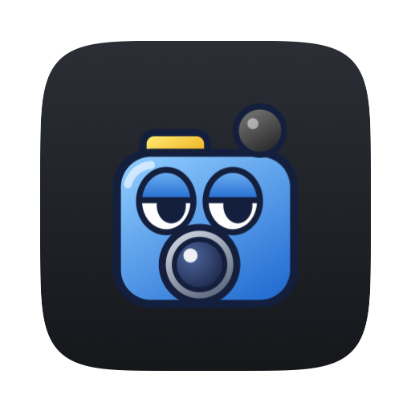
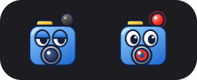

# MacRecorder

<p align="center"></p>

<p align="center">Part of <strong><a href="https://menumon.nicksmith.software">Menumon</a></strong>.</p>

A standalone macOS menu-bar app that records the screen **with system audio**,
triggered by **⌘⇧5** (the shortcut macOS normally gives the Screenshot tool).
Recordings go **straight to `~/Downloads`**, with no preview.

Built on [StatusItemKit](https://github.com/nicholaspsmith/StatusItemKit) and
[HotkeyKit](https://github.com/nicholaspsmith/HotkeyKit) (the global key-tap
engine).

## Requirements

- macOS 15+ (`SCRecordingOutput`)
- Swift toolchain (Xcode or the Command Line Tools)
- `../StatusItemKit` and `../HotkeyKit` checked out next to this repo
- **Screen Recording** and **Accessibility** permissions

## The menu-bar icon



A blue camcorder with a face. **Idle:** the record light is dark and the eyes
are half closed. **Recording:** the light glows red, with a red ring in the
lens. **Icon ▸ Symbol** switches to the plain `record.circle` symbol, which
becomes a solid red dot while recording.

## What it does

| Trigger (default) | Action |
|-------------------|--------|
| `⌘⇧5` | Start/stop recording the **whole main display** |
| `⌘⇧6` | Start a **drag-to-select region** recording (Esc cancels the picker) |

Stop a recording by pressing the mode's shortcut again, pressing **Esc**, or
**left-clicking the menu-bar icon**. The `.mov` is saved to `~/Downloads` as
`Screen Recording YYYY-MM-DD at HH.MM.SS.mov`.

- **System audio only**, captured natively by ScreenCaptureKit: no microphone,
  no BlackHole or virtual device, and you still hear audio normally.
- Both shortcuts are **rebindable** in Preferences. Esc is fixed, and passes
  through to other apps when nothing is recording.

### The menu

- **Idle:** **Record Entire Screen** and **Record Selected Area** (with their shortcuts), **⚠ Grant Screen
  Recording…** / **⚠ Grant Accessibility…** (only until granted),
  **Preferences…** (⌘,), **Icon** (Camcorder / Symbol), **Start at Login**,
  **Quit MacRecorder** (⌘Q).
- **Recording:** left-click stops; right- or control-click opens a menu with
  **■ Stop Recording** and **Quit MacRecorder**.

## How it works

- **ScreenCaptureKit** (`SCStream` + `SCRecordingOutput`) captures the display
  plus system audio (`capturesAudio` on, `excludesCurrentProcessAudio` on, mic
  untouched) and writes the `.mov` directly, with no `AVAssetWriter`. Region
  recording crops via `SCStreamConfiguration.sourceRect`.
- **HotkeyKit** owns a `CGEventTap` that intercepts the mode shortcuts and
  **swallows** them, so macOS's screenshot toolbar never appears.
- **RecorderStatusItem** owns its own `NSStatusItem` instead of StatusItemKit's
  `StatusItemController`, because it needs a left-click to stop while recording.
  StatusItemKit still provides the icon drawing (`CharacterIcon.camcorder`,
  `MeterIcon`) and Start at Login (`SMAppService`). It does not run a
  `YieldClient`.

## Install

```sh
./install.sh
```

Builds `MacRecorder.app`, symlinks it into `~/Applications`, and launches it.
Grant **Screen Recording** and **Accessibility** when prompted; the menu shows a
"⚠ Grant…" item until you do.

### Start at Login (optional)

Toggle it from the menu, or from the shell:

```sh
"$HOME/Applications/MacRecorder.app/Contents/MacOS/MacRecorder" --login on       # or: off, status
```

`install.sh` offers to run this when run in a terminal. Start at Login is
`SMAppService.mainApp`, which can only register the calling process's own
bundle, so the command must be the *installed* binary. A bare `--login` or
`--login status` only reports the state.

## Develop

```sh
swift build           # compile
swift test            # MacRecorderCore unit tests
```

## Layout

- `Sources/MacRecorderCore` — pure, unit-tested logic (modes, default bindings,
  output-path formatting).
- `Sources/MacRecorder` — the app (recorder, region selector, status item,
  hotkeys, preferences).
- `Resources/bundle/AppIcon.icns` — placeholder app icon (red record dot on a
  dark squircle), generated by `swift scripts/make-icon.swift`; replace it with
  real artwork by dropping in a new `.icns`.
- [`docs/superpowers/specs/2026-06-29-macrecorder-design.md`](docs/superpowers/specs/2026-06-29-macrecorder-design.md) — design spec.

## Why not a SwiftBar plugin?

A standalone `.app` built on [StatusItemKit](https://github.com/nicholaspsmith/StatusItemKit) needs no SwiftBar, has a real AppKit menu instead of rendered stdout, updates on events instead of a re-run timer, and keeps its place in the bar. Recording the screen with system audio uses ScreenCaptureKit, and the global ⌘⇧5 hotkey comes from HotkeyKit's `CGEventTap`; neither is reachable from a plugin script. The full comparison is in [StatusItemKit's README](https://github.com/nicholaspsmith/StatusItemKit#why-not-swiftbar).

## The menu-bar suite

A suite of macOS menu-bar apps that share one framework, one build-and-sign
script and one installer, built to sit in the same bar: consistent menus, a
common **Icon** picker, and cooperative hiding so no icon strands another.

| App | What it does |
|---|---|
| [Claude Usage](https://github.com/nicholaspsmith/claude-usage-menubar) | Claude Code plan limits, resets, and live agent sessions |
| [Apollo Monitor](https://github.com/nicholaspsmith/apollo-monitor-menubar) | Apollo audio-interface monitor level |
| [Battery Time](https://github.com/nicholaspsmith/battery-time-menubar) | Time remaining, power mode, and 24h usage |
| [VPN & DNS](https://github.com/nicholaspsmith/vpn-dns-menubar) | An iguana for Mullvad + Tailscale state, with a DNS watcher |
| [Mac Daddy](https://github.com/nicholaspsmith/mac-daddy-menubar) | Kills media trackers, trashes stale downloads, reaps hung processes, watches the UA mixer engine, and sweats as your process count climbs |
| [KeyLight](https://github.com/nicholaspsmith/keylight-menubar) | Ctrl+brightness keys remapped to keyboard backlight |
| [Monitor Lizard](https://github.com/nicholaspsmith/monitor-lizard-menubar) | External-monitor brightness, contrast and resolution, Night Shift, and the built-in screen from dimmer than macOS allows to XDR |
| [Homestead](https://github.com/nicholaspsmith/home-assistant-menubar) | Home Assistant dashboards and device controls in the menu |
| [SoundChain](https://github.com/nicholaspsmith/soundchain-menubar) | One chain of Audio Unit effects over all system audio |
| [Menu Crane](https://github.com/nicholaspsmith/menu-crane) | A ⌘Space launcher for apps, arithmetic, unit conversions and emoji |
| **MacRecorder** | Screen recording with system audio |
| [Barn](https://github.com/nicholaspsmith/menubar-barn) | macOS 26 and earlier only: hides a block of status icons by width (on macOS 27, use System Settings ▸ Menu Bar) |

| Framework | |
|---|---|
| [StatusItemKit](https://github.com/nicholaspsmith/StatusItemKit) | Status-item lifecycle, polling, menus, meter and mascot icons, the shared Icon picker |
| [HotkeyKit](https://github.com/nicholaspsmith/HotkeyKit) | CGEventTap engine for intercepting and remapping global keys |

Install the whole suite on a fresh Mac with
[macOS Dev Environment Setup](https://github.com/nicholaspsmith/MacOS-Dev-Environment-Setup):

```bash
git clone https://github.com/nicholaspsmith/MacOS-Dev-Environment-Setup.git
cd MacOS-Dev-Environment-Setup && ./bootstrap.sh --all
```

## Releasing

Every push to `main` is a release. Before pushing, add a dated
`## [X.Y.Z] - YYYY-MM-DD` section to the top of [`CHANGELOG.md`](CHANGELOG.md)
(minor for features, patch for fixes; turn a waiting `## [Unreleased]` into
it). When it reaches `main`, GitHub tags `vX.Y.Z` and publishes the section as
a release titled `vX.Y.Z`. Without a new version:

- a push is refused locally by the `pre-push` hook;
- a pull request **cannot merge** — `release / check` is required on `main`;
- a push that reaches `main` anyway fails the release workflow.

The one exception is `[no release]` in the tip commit's message, for changes
nothing a user runs (setup, CI, developer docs): it passes every check with no
version bump and no tag. Never tag or create a release by hand, and never
`gh pr merge --admin` past a failing check — fix the PR. After merging,
`git pull` for the tag and rebuild. `install.sh` re-arms the hook on a fresh
clone.
See [StatusItemKit — Releases](https://github.com/nicholaspsmith/StatusItemKit#releases-every-push-is-one) for the whole rule.

## License

Copyright (c) 2026 Nicholas Smith. Licensed under the
[Mozilla Public License 2.0](LICENSE). You may use, modify, sell and
redistribute this software, including inside proprietary products, provided
the copyright notice and license stay on these files and any modified
versions of them are made available under the same license.
